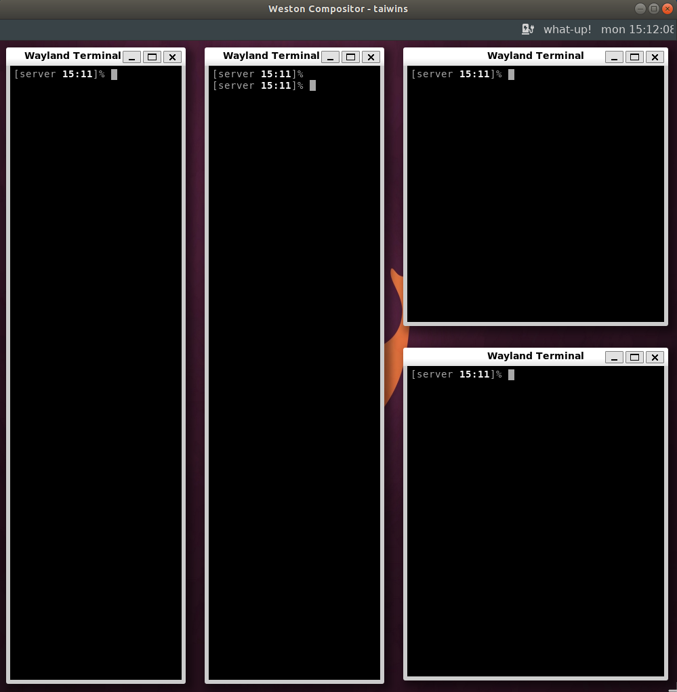

## Taiwins, a morden window manager based on libweston

Taiwins is a wayland tiling window manager project based on **libweston**. It is
designed to be mordern and modular. It has built-in shell and widget
implementation thus it is extensible, it supports popular tiling window manager
features like gapping.

It is currently usable but still under developement. You can refer to
[progress](docs/progress.org) for current progress.

## How to build
you will need following dependencies
- Pixman
- libweston(if you have an nvidia graphics card you may need weston-eglstream)
- xkbcommon
- libinput
- wayland
- wayland protocols
- cairo
- lua
- librsvg
- opengl>=3.3
- cmake

build steps:

	git clone https://github.com/xeechou/taiwins-weston taiwins && cd taiwins
	git submodule init
	git submodule update
	mkdir build && cd build
	cmake ..
	make -j8

## How to run

Here is currently how I run the compositor, it has no configuration now, will be
added as lua script later.

	cd build
	./bin/taiwins ./bin/shell-taiwins ./bin/shell-console

### key-bindings
Those bindings are hard-coded right now

- `F12` : quit taiwins
- `Ctrl+LEFT/RIGHT` switch to previous/next workspace
- `Alt+Super+b` switch to last workspace
- `Alt+LEFT` resize window to the left (only in tiling mode)
- `Alt+RIGHT` resize window to the right (only in tiling mode)
- `Ctrl+Space` toggle vertical/horizental layout (only in tiling mode)
- `Alt+Shift+Space` toggle window floating/tiling
- `Alt+Shift+j` cycle through applications
- `Ctrl+v` creating vertical sub-layout (only in tiling mode)
- `Ctrl+h` creating horizental sub-layout (only in tiling mode)
- `Ctrl+m` merge current application to parent layout
- `Ctrl+p` calling **shell-console** to launch application

### Screenshots
- widget example

- opening application in floating mode

- opening application in tiling mode

